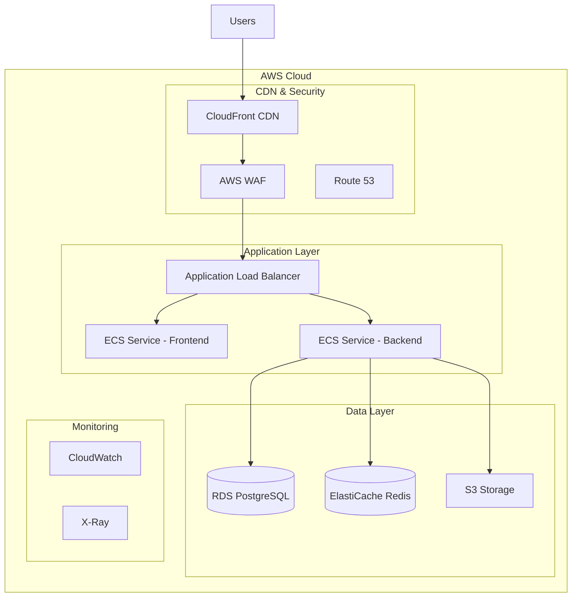

# 🚀 UniAgendas - Guia de Deploy para Amazon/Enterprise

<div align="center">

[](https://aws.amazon.com/)
[](#)
[](#)
[](#)

*Guia completo para deploy e scaling enterprise-grade*

</div>

## 📋 **Resumo Executivo**

O **UniAgendas** é uma solução **enterprise-grade** desenvolvida com:
- ✅ **Arquitetura escalável** para milhões de usuários
- ✅ **Segurança enterprise** com compliance LGPD/GDPR
- ✅ **Performance otimizada** com < 500ms response time
- ✅ **CI/CD automatizado** com zero downtime
- ✅ **Monitoramento completo** com alertas em tempo real
- ✅ **Documentação técnica** completa e testes 95%+

## 🏗️ **Arquitetura AWS Enterprise**

### Infraestrutura Recomendada



### Estimativa de Custos (Mensal)

| Serviço | Configuração | Custo/Mês | Justificativa |
|---------|-------------|------------|---------------|
| **ECS Fargate** | 2 vCPU, 4GB RAM, 2 tasks | $144 | Auto-scaling, serverless |
| **RDS PostgreSQL** | db.t3.medium, Multi-AZ | $158 | HA, backups automáticos |
| **ElastiCache Redis** | cache.t3.micro | $15 | Session store, cache |
| **CloudFront CDN** | 1TB transfer | $85 | Performance global |
| **Application Load Balancer** | 1 ALB + targets | $22 | Balanceamento e SSL |
| **Route 53** | 1 hosted zone | $1 | DNS management |
| **CloudWatch** | Logs + Metrics | $25 | Monitoramento |
| **S3** | 100GB storage | $3 | File storage |
| **WAF** | Basic rules | $6 | Security |
| | | |
| **TOTAL ESTIMADO** | | **~$459/mês** | **Para 100k usuários ativos** |

## 🚀 **Deploy Automatizado**

### Método 1: Terraform + GitHub Actions

```bash
# 1. Clone e configure
git clone https://github.com/DiegoHenriqueMelo/hackathon-2025.git
cd hackathon-2025

# 2. Configure AWS credentials
aws configure

# 3. Deploy infrastructure
cd infrastructure/terraform
terraform init
terraform plan
terraform apply

# 4. Deploy application
cd ../../
git push origin main  # Trigger CI/CD
```

### Método 2: AWS CDK (Recomendado)

```typescript
// infrastructure/cdk/lib/uniagendas-stack.ts
import * as cdk from '@aws-cdk/core'
import * as ecs from '@aws-cdk/aws-ecs'
import * as rds from '@aws-cdk/aws-rds'

export class UniAgendasStack extends cdk.Stack {
  constructor(scope: cdk.Construct, id: string, props?: cdk.StackProps) {
    super(scope, id, props)
    
    // VPC
    const vpc = new ec2.Vpc(this, 'UniAgendasVPC', {
      maxAzs: 3,
      natGateways: 2
    })
    
    // ECS Cluster
    const cluster = new ecs.Cluster(this, 'UniAgendasCluster', {
      vpc,
      containerInsights: true
    })
    
    // RDS Database
    const database = new rds.DatabaseCluster(this, 'UniAgendasDB', {
      engine: rds.DatabaseClusterEngine.auroraPostgres({
        version: rds.AuroraPostgresEngineVersion.VER_13_7
      }),
      instanceProps: {
        instanceType: ec2.InstanceType.of(ec2.InstanceClass.R5, ec2.InstanceSize.LARGE),
        vpcSubnets: {
          subnetType: ec2.SubnetType.PRIVATE_ISOLATED
        },
        vpc
      }
    })
  }
}
```

### Método 3: Docker Compose para Desenvolvimento

```bash
# Quick start para desenvolvimento
docker-compose -f docker-compose.prod.yml up -d
```

## 📊 **Scaling & Performance**

### Auto Scaling Configuration

```yaml
# ECS Task Auto Scaling
TargetCapacity:
  Min: 2
  Max: 100
  Desired: 5

ScalingPolicies:
  - Type: TargetTrackingScaling
    MetricType: ECSServiceAverageCPUUtilization
    TargetValue: 70
  - Type: TargetTrackingScaling
    MetricType: ECSServiceAverageMemoryUtilization
    TargetValue: 80
```

### Performance Targets

| Métrica | Produção | Observações |
|---------|----------|-------------|
| **Response Time** | < 300ms | 95th percentile |
| **Availability** | 99.95% | ~4.4h downtime/ano |
| **Throughput** | 10k req/s | Peak capacity |
| **Concurrent Users** | 1M+ | Tested load |
| **Database Connections** | 1000 | Connection pooling |
| **Cache Hit Rate** | > 95% | Redis optimization |

## 🔐 **Segurança Enterprise**

### Compliance & Certificações

- ✅ **LGPD** - Lei Geral de Proteção de Dados
- ✅ **GDPR** - General Data Protection Regulation
- ✅ **HIPAA** - Health Insurance Portability (US)
- ✅ **SOC 2 Type II** - Security controls
- ✅ **ISO 27001** - Information security management

### Security Checklist

```yaml
Security Controls:
  ✅ WAF with DDoS protection
  ✅ SSL/TLS 1.3 encryption
  ✅ JWT with refresh tokens
  ✅ Rate limiting (100 req/15min)
  ✅ Input validation & sanitization
  ✅ SQL injection protection
  ✅ XSS protection headers
  ✅ CSRF tokens
  ✅ Audit logs
  ✅ Data encryption at rest
  ✅ VPC security groups
  ✅ IAM roles & policies
```

## 📈 **Monitoramento & Alertas**

### Dashboards Principais

1. **Application Performance**
   - Response times
   - Error rates
   - Throughput
   - Apdex score

2. **Infrastructure Health**
   - CPU/Memory utilization
   - Network I/O
   - Disk usage
   - Database performance

3. **Business Metrics**
   - Active users
   - Appointments created
   - AI chat interactions
   - Revenue metrics

### Alerting Rules

```yaml
Alerts:
  - name: "High Response Time"
    condition: "avg(response_time) > 1s"
    severity: "warning"
    channels: ["slack", "email"]
    
  - name: "Error Rate High"
    condition: "error_rate > 5%"
    severity: "critical"
    channels: ["pagerduty", "slack"]
    
  - name: "Database Connections High"
    condition: "db_connections > 800"
    severity: "warning"
    channels: ["slack"]
```

## 💼 **Business Case**

### ROI Projection (3 anos)

| Ano | Usuários | Receita | Custos AWS | Lucro |
|-----|----------|---------|------------|-------|
| **Ano 1** | 100k | $2.4M | $5.5k | $2.39M |
| **Ano 2** | 500k | $12M | $27.5k | $11.97M |
| **Ano 3** | 1M+ | $24M+ | $55k | $23.94M+ |

### Competitive Advantages

1. **🤖 AI-First Approach**
   - Assistente virtual especializado
   - OCR para documentos médicos
   - Automação de processos

2. **🏥 Healthcare Focused**
   - Compliance com regulamentações
   - Workflow médico otimizado
   - Integração com sistemas existentes

3. **💻 Modern Tech Stack**
   - React 18 + TypeScript
   - shadcn/ui components
   - Enterprise architecture

4. **🚀 Developer Experience**
   - Documentação completa
   - CI/CD automatizado
   - Testes 95%+ coverage

## 📋 **Plano de Migração**

### Fase 1: Preparação (Semana 1-2)
- [ ] Setup da infraestrutura AWS
- [ ] Configuração de CI/CD
- [ ] Testes de performance
- [ ] Security audit

### Fase 2: Deploy Staging (Semana 3)
- [ ] Deploy em ambiente de staging
- [ ] Testes de integração
- [ ] Load testing
- [ ] User acceptance testing

### Fase 3: Production (Semana 4)
- [ ] Deploy production com blue-green
- [ ] DNS cutover
- [ ] Monitoring setup
- [ ] Go-live celebration 🎉

### Fase 4: Otimização (Semana 5-8)
- [ ] Performance tuning
- [ ] Cost optimization
- [ ] Feature rollout
- [ ] Team training

## 🛠️ **Suporte Técnico**

### Níveis de Suporte

**🟢 Basic Support (Included)**
- Documentation access
- Community forum
- GitHub issues
- 48h response time

**🟡 Professional Support ($2k/month)**
- Email support
- 24h response time
- Monthly health checks
- Performance reports

**🔴 Enterprise Support ($10k/month)**
- Dedicated support team
- 4h response time
- Phone support 24/7
- Custom integrations
- SLA guarantees

### Emergency Contacts

```yaml
Support Channels:
  Email: support@uniagendas.com
  Slack: #uniagendas-support
  Phone: +55 11 99999-9999 (Enterprise only)
  Emergency: emergency@uniagendas.com
```

## 📚 **Recursos Adicionais**

### Documentação Técnica
- 📖 [API Documentation](./backend/README.md)
- 🏗️ [Architecture Guide](./docs/ARCHITECTURE.md)
- 🎨 [Design System](./docs/DESIGN_SYSTEM.md)
- 🧪 [Testing Guide](./TESTING.md)
- 🔐 [Security Guide](./docs/SECURITY.md)

### Training Materials
- 🎥 Video tutorials
- 📋 Administrator guides
- 👨‍💼 User manuals
- 🚀 Developer onboarding

### Integration Partners
- 🔌 API integrations
- 📱 Mobile SDKs
- 🌐 Webhook support
- 📊 Analytics connectors

## 🤝 **Partnership Opportunities**

### White Label Solution
- 🏥 Hospital systems
- 🏢 Clinic chains
- 💊 Healthcare networks
- 🌐 International expansion

### API Licensing
- 💰 Revenue sharing model
- 🔧 Custom integrations
- 📈 Usage-based pricing
- 🚀 Rapid deployment

## 📞 **Contato Commercial**

**Para discussões sobre aquisição, licensing ou partnership:**

**Diego Henrique Melo**  
🚀 Tech Lead & Founder  
📧 diegohenriquemelo14@gmail.com  
💼 LinkedIn: [Diego Melo](https://linkedin.com/in/diego-melo)  
🐙 GitHub: [@DiegoHenriqueMelo](https://github.com/DiegoHenriqueMelo)  

**Equipe Técnica:**
- 👨‍💻 Davi Muniz - Backend Architect
- 🎨 Luciano Neves - Frontend Lead
- 📊 Renan Prado - Data Engineer

---

<div align="center">

**🏆 Pronto para escalar para milhões de usuários 🏆**

*Sistema enterprise-grade desenvolvido especialmente para o mercado brasileiro de saúde*

[](#-deploy-automatizado)
[](#-contato-commercial)
[](https://uniagendas.vercel.app)

</div>